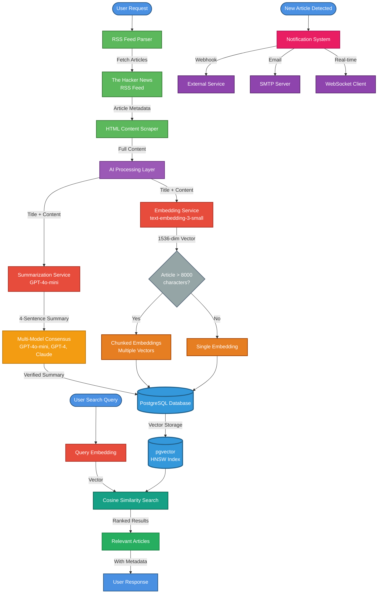

# SheepAI Data Flow Diagram

## Mermaid Diagram (for rendering)

## Simplified Flow (for PowerPoint)

```mermaid
flowchart LR
    A[RSS Feed] --> B[Content Scraper]
    B --> C[AI Summarization]
    C --> D[Multi-Model Consensus]
    D --> E[Vector Embedding]
    E --> F[PostgreSQL + pgvector]
    F --> G[Semantic Search]
    G --> H[User Results]
    
    I[New Article] --> J[Notification System]
    J --> K[Webhook/Email/WebSocket]
    
    style A fill:#5CB85C,stroke:#3A7A3A,stroke-width:2px,color:#fff
    style B fill:#5CB85C,stroke:#3A7A3A,stroke-width:2px,color:#fff
    style C fill:#E74C3C,stroke:#A93226,stroke-width:2px,color:#fff
    style D fill:#F39C12,stroke:#B9770E,stroke-width:2px,color:#fff
    style E fill:#E74C3C,stroke:#A93226,stroke-width:2px,color:#fff
    style F fill:#3498DB,stroke:#21618C,stroke-width:3px,color:#fff
    style G fill:#16A085,stroke:#0E6655,stroke-width:2px,color:#fff
    style H fill:#27AE60,stroke:#1E8449,stroke-width:2px,color:#fff
    style I fill:#4A90E2,stroke:#2E5C8A,stroke-width:2px,color:#fff
    style J fill:#E91E63,stroke:#AD1457,stroke-width:2px,color:#fff
    style K fill:#8E44AD,stroke:#5B2C6F,stroke-width:2px,color:#fff
```

## Text Description for Manual Creation

**Article Collection Flow:**
1. RSS Feed → Parser extracts metadata
2. HTML Scraper → Fetches full content from URLs
3. AI Summarization → GPT-4o-mini generates 4-sentence summary
4. Multi-Model Consensus → Cross-validates with GPT-4 and Claude
5. Vector Embedding → OpenAI converts content to 1536-dim vector
6. Database Storage → PostgreSQL with pgvector stores article + embedding

**Search Flow:**
1. User Query → Natural language prompt
2. Query Embedding → Convert to vector
3. Similarity Search → Cosine similarity in pgvector
4. Results → Ranked by relevance score

**Notification Flow:**
1. New Article → Detected in RSS feed
2. Notification System → Checks user preferences
3. Delivery → Webhook, Email, or WebSocket

